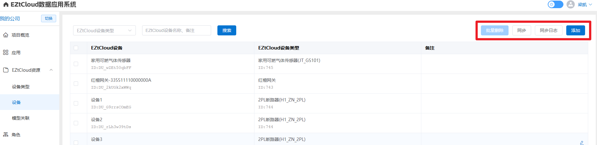

# EZtView 快速入门

EZtView — 智慧能耗管理应用平台，让智慧用能触手可及。[立即登录](https://www.eztview.com/)

更新日期：2025-06-25

---

## 项目列表

成功登录后进入项目列表页，显示“我创建的项目”和“我加入的项目”，如果没有任何项目，可以点击“点击此处添加项目”自主创建空白项目，或者让项目拥有者用户邀请您进入他的项目。

名词解释：

- **我创建的项目：**本账号自主创建的空白项目，需要给项目起个名字；
- **我加入的项目：**A账号创建的项目可以邀请B账号进入该项目，成功邀请后，B账号“我加入的项目”列表会出现该项目；
- **项目拥有者：**本账号自主创建的项目是该项目的拥有者，具有全部权限。

## **控制台**

控制台是该项目的管理中心，点击“切换”按钮，可以切换其他项目。

### 项目概览

可以设置项目信息、显示角色数量、组织数量、成员数量、项目配置指引。

点击按钮，设置项目信息，包括给项目设定标题，项目重命名。

项目配置一般按照“项目指引”操作，第一步根据需求选择应用，第二步将EZtCloud资源引入该项目，包括EZtCloud项目绑定，设备类型添加、设备添加，第三步将EZtCloud设备类型与EZtView设备模型绑定；第四步配置组织，并将设备添加到组织；第五步配置组织应用，包括将设备添加到应用。

名词解释：

- 什么是EZtCloud？EZtCloud是我司开发的设备统一接入平台，EZTView应用平台是基于EZtCloud提供的数据资源开发，所以EZtView一个项目必定要绑定EZtCloud的一个项目，两个平台登录账号密码相同，EZtCloud平台网址：https://www.eztcloud.com

### 应用

包括“应用市场”和“我的应用”

一个项目一般都有确定的需求，根据需求在应用市场找应用，然后点击“添加”，就将该应用成功添加到我的应用，我司会不断开发新的通用应用，以满足不同行业需求。

注：此处添加的应用是该项目应用，不同组织可能需要的应用不同，所以组织可以根据需求从项目应用列表选择。

### EZtCloud资源

包括添加设备类型、添加设备和将设备类型与设备模型关联。

- **设备类型页**有“添加”和“同步”两个按钮。添加按钮，是将EZtCloud设备类型添加到本系统，当EZtCloud设备类型信息改变，点击“同步”按钮，比如修改了设备类型名称。
    
    
    
- **设备页**有“批量删除”、同步、同步日志、添加，四个按钮
    
    “添加”按钮是将已添加的设备类型下的设备添加到本系统；
    
    “同步”按钮可以快速将已添加的设备类型下的设备添加到本系统；
    
    “同步日志”按钮可以查看同步操作记录；
    
    “批量删除”可以将设备批量从本系统删除。
    
    
    
- **模型关联**是EZtView平台的重要概念，当一个应用开发完成，则该应用对应的设备模型是确定的，一个设备模型包含多个属性，每个属性表示该设备模型的一种功能，属性都有固定的标识符；一个设备模型可以对用多个EZtCloud设备类型，一个EZtCloud设备类型也可以对应多个设备模型。
    
    
    

### 角色

角色用于一类用户需要相同的项目权限和应用权限，比如A和B用户具有相同的查看权限和操作权限。点击“添加角色”进入新角色配置界面，给角色配置一个名称。“查看”勾选，表示用户账号可以显示该菜单，项目权限“编辑”勾选，表示用户可以进行项目相关配置，应用权限“操作”勾选，表示用户可以下发控制命令给设备。

### 组织

一个项目会自动生成一个默认根组织(不能删除)，可以给每个组织添加成员，添加设备，组织下可以创建子组织，组织可以排序，可以修改组织名称，可以复制组织URL链接(这样用户可以快速登录到该组织应用详情页)。**提示：点击组织名称可以进入该组织详情页。**

### 成员

每个成员具有账号、昵称、所属组织(可多个)、绑定角色(可多个角色)、绑定的邮箱、绑定的手机号登信息，一个项目有一个项目拥有者，项目拥有者点击“邀请成员”来邀请其他用户进入该项目

## **工作台**

工作台通常是最终用户直接使用的界面。它面向具体应用场景及相应功能。

进入组织工作台路径：

组织工作台样例：

每个组织都有“应用管理”菜单(当有权限时)，可以将该项目应用添加到组织应用，每个组织应用具有“配置”和“移除”按钮，一般应用配置包括应用重命名，给应用添加设备、设备分组等功能，不同的应用配置可能不同，当不需要该应用时，可以点击“移除”将该应用删除，应用移除后再添加，该应用的配置保持不变。

